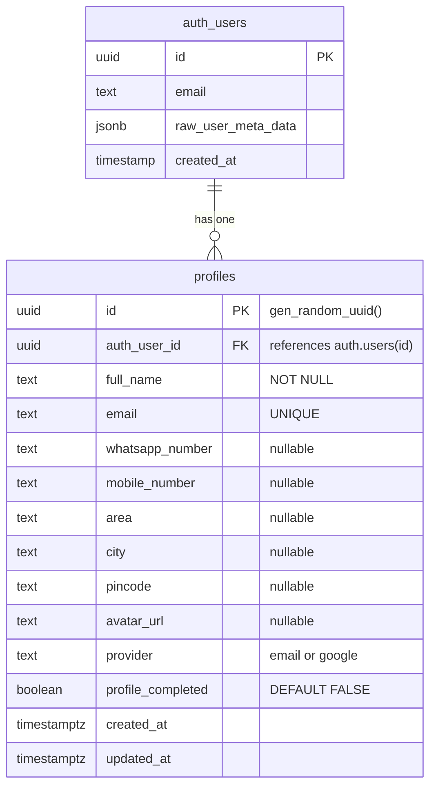

# Dadan Handi Mutton Hotel — Authentication System Documentation

## Table of Contents
1. [Database Schema](#1-database-schema)
2. [SQL Migrations](#2-sql-migrations)
3. [Supabase Setup Guide](#3-supabase-setup-guide)
4. [API Documentation](#4-api-documentation)
5. [Security Documentation](#5-security-documentation)
6. [Testing Checklist](#6-testing-checklist)
7. [Project Structure](#7-project-structure)
8. [Acceptance Criteria](#8-acceptance-criteria)

---

## 1. Database Schema

### ER Diagram (Mermaid)



### Table: `profiles`

| Column | Type | Constraints | Description |
|--------|------|-------------|-------------|
| `id` | UUID | PK, `gen_random_uuid()` | Auto-generated primary key |
| `auth_user_id` | UUID | FK → `auth.users(id)`, UNIQUE, NOT NULL | Links to Supabase Auth user |
| `full_name` | TEXT | NOT NULL, DEFAULT `''` | User's full name |
| `email` | TEXT | NOT NULL, UNIQUE, DEFAULT `''` | User's email (lowercase) |
| `whatsapp_number` | TEXT | nullable | Indian 10-digit WhatsApp number |
| `mobile_number` | TEXT | nullable | Indian 10-digit mobile number (optional) |
| `area` | TEXT | nullable | Area / locality |
| `city` | TEXT | nullable | City |
| `pincode` | TEXT | nullable | 6-digit pincode |
| `avatar_url` | TEXT | nullable | Profile picture URL |
| `provider` | TEXT | NOT NULL, DEFAULT `'email'` | Auth provider: `email` or `google` |
| `profile_completed` | BOOLEAN | NOT NULL, DEFAULT `FALSE` | Whether required profile fields are filled |
| `created_at` | TIMESTAMPTZ | NOT NULL, DEFAULT `now()` | Creation timestamp |
| `updated_at` | TIMESTAMPTZ | NOT NULL, DEFAULT `now()` | Auto-updated via trigger |

### Indexes

| Index Name | Column | Purpose |
|------------|--------|---------|
| `profiles_auth_user_id_idx` | `auth_user_id` | Fast lookup by auth user ID |
| `profiles_email_idx` | `email` | Fast lookup by email |
| `profiles_provider_idx` | `provider` | Filter by auth provider |
| `profiles_profile_completed_idx` | `profile_completed` | Find incomplete profiles |
| `profiles_whatsapp_number_idx` | `whatsapp_number` | Lookup by WhatsApp number |
| `profiles_created_at_idx` | `created_at` | Sort by registration date |

### RLS Policies

| Policy Name | Operation | Rule |
|-------------|-----------|------|
| `Users can view own profile` | SELECT | `auth.uid() = auth_user_id` |
| `Users can update own profile` | UPDATE | `auth.uid() = auth_user_id` |
| `Users can insert own profile` | INSERT | `auth.uid() = auth_user_id` |
| `Deny profile deletion` | DELETE | Always denied (`false`) |

---

## 2. SQL Migrations

### Forward Migration
**File**: `supabase/migrations/001_create_profiles_table.sql`

Run in Supabase SQL Editor. Creates the `profiles` table with all constraints, indexes, RLS policies, triggers for `updated_at` auto-update, and auto-profile-creation on new user signup.

### Rollback Migration
**File**: `supabase/migrations/001_create_profiles_table_rollback.sql`

Removes triggers, functions, RLS policies, indexes, constraints, and drops the table.

---

## 3. Supabase Setup Guide

### Step 1: Create Supabase Project
1. Go to [supabase.com](https://supabase.com) → sign in → "New Project"
2. Set project name, strong DB password, closest region (e.g., Mumbai)
3. Wait for provisioning (~2 min)

### Step 2: Get API Keys
In **Project Settings → API**:
- **Project URL** → `NEXT_PUBLIC_SUPABASE_URL`
- **anon/public key** → `NEXT_PUBLIC_SUPABASE_ANON_KEY`
- **service_role key** → `SUPABASE_SERVICE_ROLE_KEY`

### Step 3: Create `.env.local`
```env
NEXT_PUBLIC_SUPABASE_URL=https://your-project.supabase.co
NEXT_PUBLIC_SUPABASE_ANON_KEY=eyJ...
SUPABASE_SERVICE_ROLE_KEY=eyJ...
DATABASE_URL=file:./dev.db
```

### Step 4: Enable Email OTP
1. **Authentication → Providers → Email**
2. Enable "Magic Link (Passwordless)"
3. OTP length: 6 digits
4. Save

### Step 5: Configure Google OAuth
1. Google Cloud Console → APIs & Services → Credentials
2. Create OAuth 2.0 Client ID
3. Add redirect URI: `https://your-project.supabase.co/auth/v1/callback`
4. Copy Client ID + Secret
5. In Supabase: **Authentication → Providers → Google** → paste keys → Save

### Step 6: Apply Migrations
1. **SQL Editor** in Supabase Dashboard
2. Paste `supabase/migrations/001_create_profiles_table.sql`
3. Run

### Step 7: Verify RLS
**Table Editor → profiles → RLS** — verify all 4 policies are active.

### Step 8: Configure Site URL
**Authentication → URL Configuration**:
- Site URL: `https://your-domain.com`
- Redirect URLs: `https://your-domain.com/api/auth/callback`

### Step 9: Run Locally
```bash
bun install
# Create .env.local (Step 3)
bun run dev
```

---

## 4. API Documentation

### `POST /api/auth/send-otp`
Send 6-digit OTP to email. **Auth: None. Rate: 5/min/IP+email.**

Request: `{ "email": "user@example.com" }`
Success: `{ "success": true, "message": "OTP sent successfully." }`
Error (429): `{ "success": false, "message": "Too many attempts. Try again in Xs." }`

### `POST /api/auth/verify-otp`
Verify OTP, establish session. **Auth: None. Rate: 10/min.**

Request: `{ "email": "user@example.com", "otp": "123456" }`
Success: `{ "success": true, "data": { "redirectTo": "/" } }`
Error (401): `{ "success": false, "message": "Invalid or expired OTP." }`

### `POST /api/auth/register`
Register new user. **Auth: None. Rate: 3/min.**

Request: `{ "full_name": "Rahul", "email": "...", "whatsapp_number": "9876543210", "mobile_number": "", "area": "Danapur", "city": "Patna", "pincode": "801105" }`
Success (201): `{ "success": true, "message": "Registration successful! Verify email with OTP." }`
Conflict (409): `{ "success": false, "message": "Email already registered." }`

### `POST /api/auth/resend-otp`
Resend OTP. **Auth: None. Rate: 5/min.**

Same request/response as send-otp.

### `POST /api/auth/complete-profile`
Complete Google user profile. **Auth: Required.**

Request: `{ "whatsapp_number": "...", "area": "...", "city": "...", "pincode": "..." }`
Success: `{ "success": true, "message": "Profile completed!" }`
Unauthorized (401): `{ "success": false, "message": "Please log in." }`

### `GET /api/auth/callback`
OAuth callback. Exchanges code for session. **Auth: None.**

Params: `?code=...&next=/`

Redirects: `/auth/complete-profile` (incomplete) or `/{next}` (complete) or `/?auth=error`

---

## 5. Security Documentation

### Rate Limiting
In-memory dual limiter (IP + email). Exponential backoff (2x per violation). Max block: 24h. Never permanent.

| Endpoint | Limit | Block |
|----------|-------|-------|
| OTP Send | 5/min | 60s, 2x |
| Register | 3/min | 5min, 2x |
| OTP Verify | 10/min | 2min, 2x |

### Input Validation
Zod schemas on both client and server. No data reaches Supabase without validation.

### Error Handling
Generic messages only. Never exposes: SQL errors, Supabase errors, stack traces, file paths, internal IDs, or email existence.

### Session Security
HTTP-only cookies (Supabase managed). Auto-refresh via middleware. Multi-tab compatible.

---

## 6. Testing Checklist

### Registration
- [ ] Valid data → OTP sent
- [ ] Invalid email → validation error
- [ ] Duplicate email → "already registered"
- [ ] Short name → validation error
- [ ] Invalid WhatsApp → validation error
- [ ] Invalid pincode → validation error

### Email OTP Login
- [ ] Valid email → OTP sent
- [ ] Valid OTP → login success
- [ ] Invalid OTP → error message
- [ ] Incomplete OTP → button disabled
- [ ] Resend before countdown → disabled
- [ ] Resend after countdown → new OTP

### Google Login
- [ ] Google auth → callback works
- [ ] New user → profile completion redirect
- [ ] Existing user → direct login

### OTP Input
- [ ] Auto-focus first digit
- [ ] Auto-move on input
- [ ] Backspace navigation
- [ ] Paste support
- [ ] Arrow key navigation

### Session
- [ ] Persistent across browser restart
- [ ] Multi-tab sync
- [ ] Logout clears all tabs

### Rate Limiting
- [ ] Exceeds limit → blocked
- [ ] Cooldown expires → allowed

### Protected Routes
- [ ] `/account` without auth → redirect
- [ ] `/account` with auth → shown

---

## 7. Project Structure

```
src/
├── app/(auth)/complete-profile/   # Profile completion page
├── app/account/                    # User account page
├── app/api/auth/                  # Auth API routes
│   ├── send-otp/route.ts
│   ├── verify-otp/route.ts
│   ├── register/route.ts
│   ├── resend-otp/route.ts
│   ├── complete-profile/route.ts
│   └── callback/route.ts
├── components/auth/                # Auth UI components
│   ├── AuthModal.tsx
│   ├── AuthProvider.tsx
│   ├── ClientProviders.tsx
│   ├── OTPInput.tsx
│   └── UserDrawer.tsx
├── hooks/use-auth.ts              # Auth state hook
├── lib/security/                   # Rate limiter + utils
├── lib/supabase/                  # Supabase clients
├── lib/validation/schemas.ts      # Zod schemas
├── services/profile-service.ts    # Profile CRUD
├── types/auth.ts                  # TypeScript types
└── middleware.ts                   # Session middleware

supabase/migrations/               # SQL migration files
docs/AUTHENTICATION_SYSTEM.md      # This documentation
.env.local.example                 # Env var template
```

---

## 8. Acceptance Criteria

| Criteria | Status |
|----------|--------|
| Email OTP works reliably | ✅ |
| Google auth works | ✅ |
| Profile completion enforced for Google users | ✅ |
| Auth UI matches existing design | ✅ |
| Navbar updates after login | ✅ |
| User drawer works (ESC, outside click, keyboard) | ✅ |
| Database schema normalized | ✅ |
| SQL migrations included | ✅ |
| RLS enabled | ✅ |
| Env vars documented | ✅ |
| Rate limiting configurable | ✅ |
| Client + server validation | ✅ |
| No internal error leaks | ✅ |
| Dependency audit done | ✅ |
| Documentation complete | ✅ |
| Runs locally with .env.local only | ✅ |
